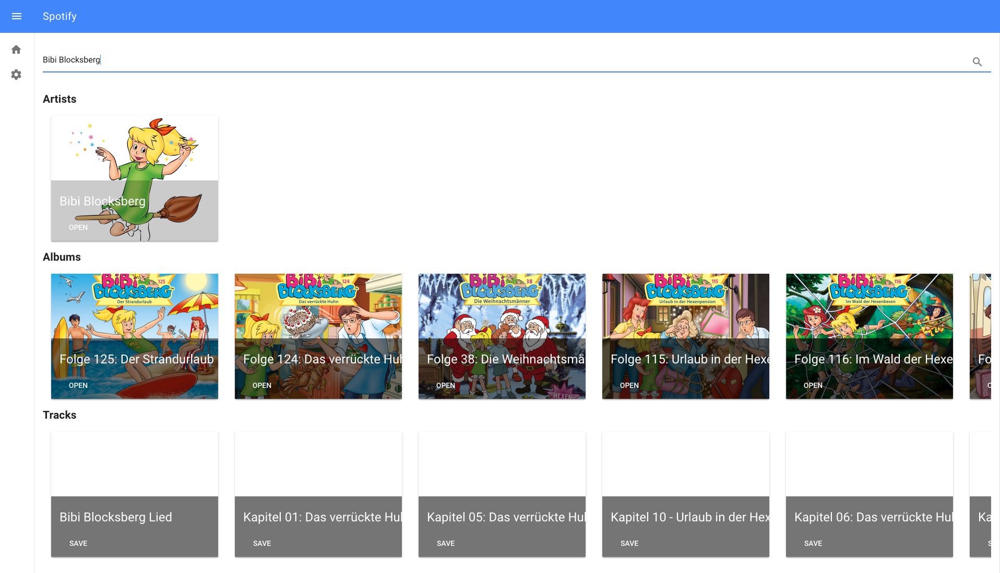

# Figure Speaker
This project is a Raspberry Pi based audio player which plays songs or audiobooks depending on a NFC Tag which is placed on the player. The NFC Tags can be attached to the bottom of a figure. This is an intuitive way for children to select the audiobooks they want to here based on the figures they associate with it.

The main feature of this project is a Spotify integration which lets you access all your favourite songs and audio books you already pay for every month.
By using the audio server [Mopidy](https://www.mopidy.com/) internally, further cloud services can be integrated really easily.

## Feature List
 - Spotify integration
 - Easy to maintain and register figures through a web application
 - Portable by using a power bank
 - Play local mp3 files
 - Configure volume
 - Max volume is configurable
 - Define what happens after the figure is replaced on the audio player
   - Play the track from the beginning
   - Play the track where you left off
 - Easy to connect to new WiFi by creating an AdHoc network if the box cannot connect to WiFi
 - Update Manager which will allow you to receive the latest features without opening the box
 - Open for other cloud services
 - Automated tests to ensure quality

### Spotify Integration

### Settings

## Manual
See [Manual](docs/manual.md) for finding out how to use figure-speaker.

## Setup
See [Setup](docs/setup.md) for setting up the Raspberry Pi.

## Assembly
In chapter [Assembly](docs/assembly.md) I documented instructions how to build the hardware of the figure speaker.
 
## TODOs
- Pause support: Start from the beginning, if track is nearly at the end
- Upload mp3 files through web app
- Bluetooth speaker support 
- Use Slip Ring to rotate figure while playing
- Create Raspberry Image automatically with build and attach it to GitHub release
