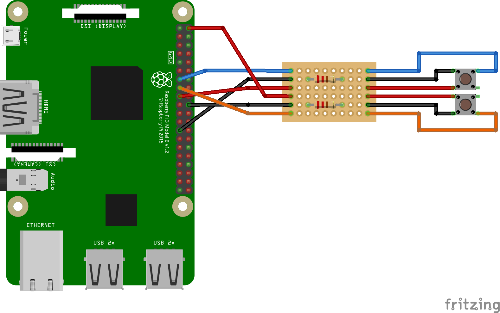
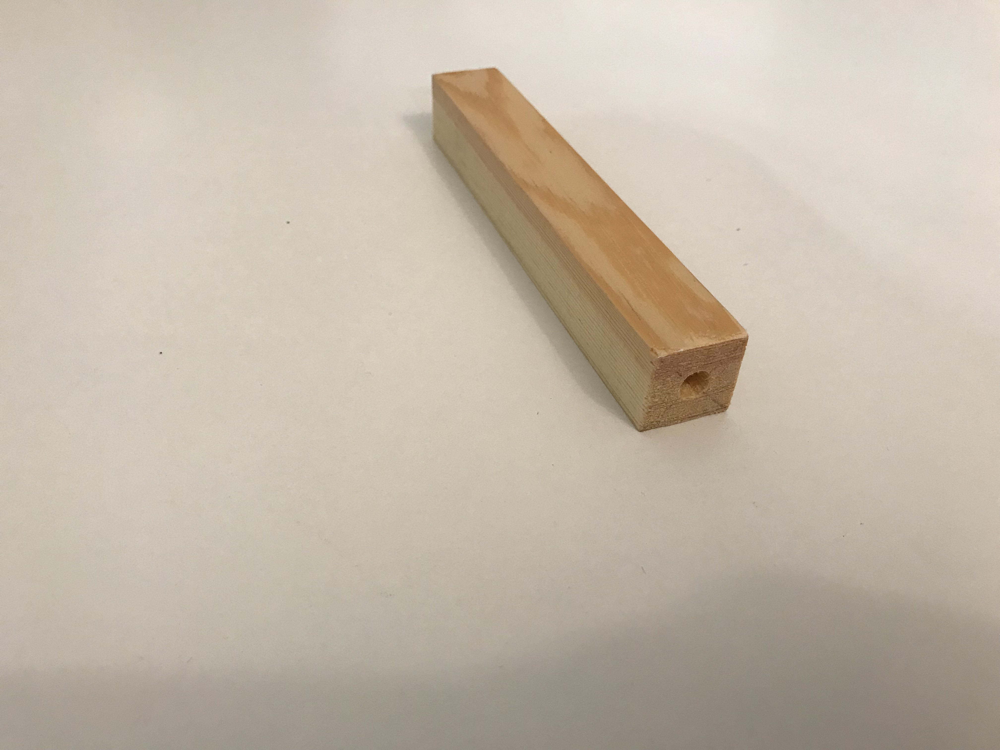
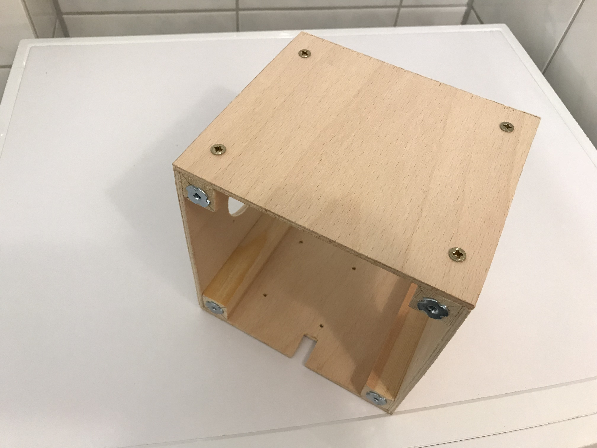

# Assembly
In this chapter you will find instructions about how to build the hardware of figure speaker.
## Connect Raspberry Pi to Modules
This section instructs you how to connect the Raspberry Pi to the different hardware modules. 

### What you need
- [Raspberry Pi 3](https://www.amazon.de/Raspberry-Pi-Model-ARM-Cortex-A53-Bluetooth/dp/B01CD5VC92/)
- [SD Card](https://www.amazon.de/SanDisk-Ultra-microSDHC-Speicherkarte-Adapter/dp/B073S9SFK2/)
- [RFID Reader](https://www.amazon.de/gp/product/B01M28JAAZ/)
- [Power Bank](https://www.amazon.de/gp/product/B00FAU7ZB2)
- [Micro USB Cable](https://www.amazon.de/gp/product/B01NAMTC5T)
- [Jumper Cable](https://www.amazon.de/gp/product/B00OL6JZ3C)
- [Buttons](https://www.amazon.de/gp/product/B0749KNQNH)
- 2x 1 kΩ Resistor
- [Speaker](https://www.amazon.de/gp/product/B073XH8KK8)
- [Amplifier](https://www.amazon.de/HER-Digital-Amplifier-PAM8403-Stereos/dp/B073HFGZQC)
- [Aux Cable](https://www.amazon.de/gp/product/B00DRCTB58)
- [Breadboard](https://www.amazon.de/gp/product/B0728HZHTR/)
- [Copper wire](https://www.amazon.de/gp/product/B0043DQ7WK)

1) If not already done, you need to solder the pins to the Raspberry Pi and the RFID Reader.
2) Connect the aux cable to the amplifier module. I cut of one end of the aux cable and strip of the isolation. Then the copper wire needs to be soldered to the amplifier.
3) Solder the speakers to the amplifiers.
4) Connect circuit bord to Raspberry Pi. I used jumper cables for connecting the the modules.

5) Create a circuit board with resistors for the volume buttons. You can find a sketch of the circuit board in the image below. I used 1 kΩ resistors. Make sure that the cables to the buttons are long enough to be placed where you want them to be.
6) Connect this circuit board to Raspberry Pi.

7) Connect RFID Reader to Raspberry Pi.

Image is taken from "https://tutorials-raspberrypi.de/raspberry-pi-rfid-rc522-tueroeffner-nfc/"

after you have wired everything, you can test if it works. In order to setup the Raspberry Pi itself from a software point of view, see chapter [Setup](./setup.md). I advise you to do the final wiring while building the box (see below). Otherwise it will be complicated to place the modules in the box.

## Build the Box
I know that there are a lot of ways to build a simple box and I am not a carpenter. So this way to build a wooden box might not be the best, but it is simple and works. However, feel free to give feedback or adjust the instructions to your needs.

Please Note: The wooden parts of the box don't need to be perfectly cut, because I wrap the whole box with foam plates, in order to make them "child safe" and robust against falling to the ground etc. 
 
The sizes of this box depend on the power bank you use and the size of the speakers. That's why there are no measures for the outlets of the power bank in order to charge it or turn it on and off.
### What you need
- 4x square mouldings: 20mm * 20mm * 140mm
- 4x captive nuts: M4 * 6
- 4x countersunk threaded screw: M3 * 16mm
- 4x wood plates for the side: 150mm * 140mm * 4mm
- 2x wood plates for the bottom/top: 150mm * 150mm * 4mm
- 20x screw spax: M4 * 12mm
- 4x countersunk threaded screw: M2 * 10mm incl. nuts
- 10x countersunk threaded screw: M3 * 10mm incl. nuts
- 4x cylinder head threaded bolt: M3 * 16mm incl. 12 nuts
- metal perforated tapes
- foam plates: about 10mm thick

### Blueprints
Two bottom / top plates:

Two side plates:

Front plate:

Back plate (notice the outlet for the power bank):

Four Struts:

### Assemble
1) Drill a 6mm hole about 10mm deep into one end of each square mouldings. Punch the captive nuts in these holes.

2) Drill a hole in the middle of two of the side plates. The speakers will be placed in these holes later on. In my case the diameter is 50mm, but it depends on the speakers you use.
Drill four 3mm holes in the corners next to the holes to attach the speakers later.
3) Drill four 2mm holes in another side plate (the back). These will be used to attach the Raspberry Pi to the box. Beware of the position of the Pi: The power bank has to be placed underneath.
4) Drill a hole in the top plate for the cables of the RFID reader; about 20mm * 10mm. In addition to that, you need four 3mm holes to connect the RFID Reader to the box.
5) Drill holes for the outlets of the powerbank: USB input and on / off button.

6) Screw the side plates to the square mouldings. The captive nuts should be on the buttom. Make sure that the plates with the speaker holes are facing each other. Use the screw spax for this. Don't screw them to close to the edge of the square mouldings, because screws need to come from the top and they shouldn't conflict.

7) Attach the Raspberry Pi to the back plate. Use 4x countersunk threaded screw: M2 * 10mm incl. nuts for this purpose.
8) Attach the speakers to the side plates. Use 8x countersunk threaded screw: M3 * 10mm incl. nuts for this purpose.

9) Attach the RFID Reader to the top plate. I used four countersunk threaded screw M3 * 16mm for this. Use three nuts for each screw in order to place the RFID Reader about 10mm above the box. This is done because the box will be wrapped with 10mm thick foam plates and the RFID Reader should be aligned with these plates.
10) Screw the top plate to the square mouldings with four screw pax M4 * 12mm

11) Wire the modules to the Raspberry Pi.

12) Drill 4mm holes in the corners of the bottom plate. They are used to screw the bottom plate to the captive nuts in the square mouldings.
13) Attach the power bank to the bottom plate. I used metal perforated tapes to realize this. These are bent over the power bank and screws hold the tape to the bottom plate. I use four countersunk threaded screw: M3 * 10mm incl. nuts for this.

14) Screw the bottom plate to the box with four countersunk threaded screws: M3 * 16mm.

15) Wrap everything with foam plates.
16) Use fabric to sew a jacket for the box.

## Build the Figures
In order to build a figure you bascially only need an nfc tag and the figure. I also recommend to use a metal plate as well, so that the figure won't fall off, because there is a magnet underneath the RFID reader.
### What you need
- [NFC Tags](https://www.amazon.de/gp/product/B01F02W45G)
- [Metal Plates](https://www.amazon.de/gp/product/B01NBUPHH6)
- A Figure